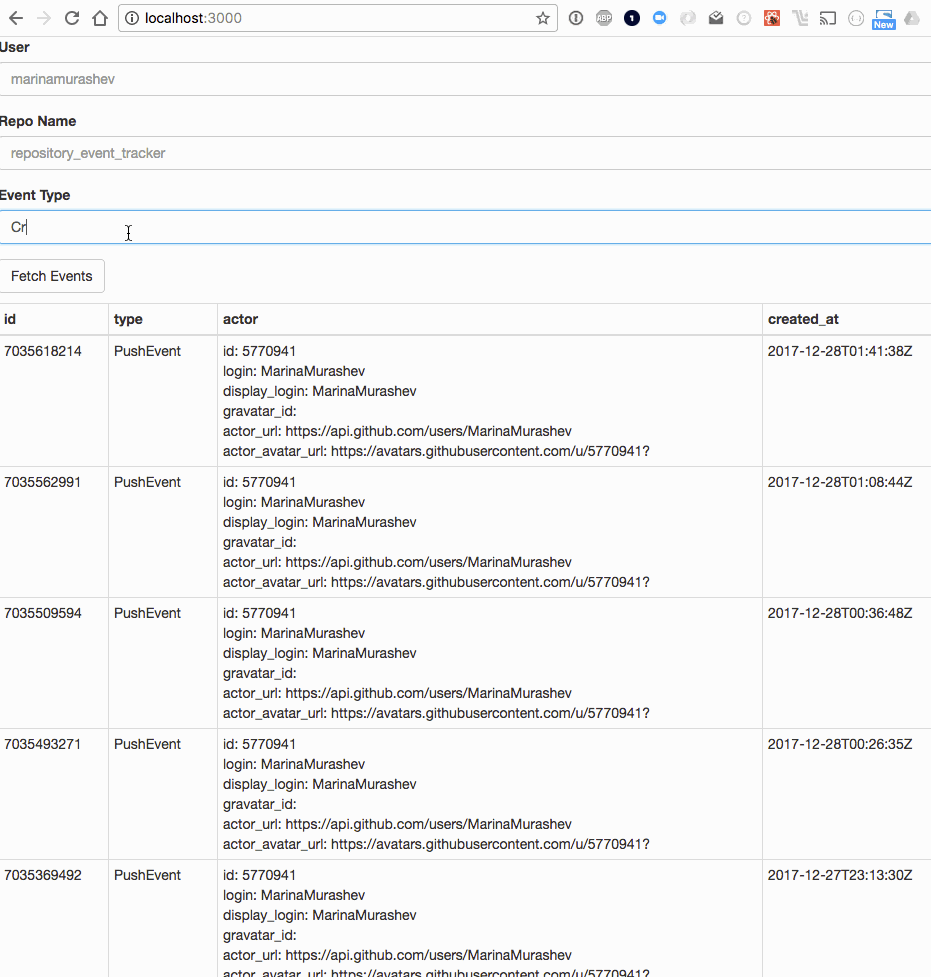

# Repository Event Tracker

This is a Rails + React app that displays responses from the [Github Events API][https://developer.github.com/v3/activity/events/], allowing you to specify the user, repository, and event type you are interested in seeing.  For example, I can input user: marinamurashev, repo name: repository_event_tracker (pretty meta, I know), and event type: CreateEvent.

Please see the Github documentation for details about the api, including response limits, event types and rate limiting.

# Brief Walkthrough

GIF created with [LiceCap](http://www.cockos.com/licecap/).

## Getting set up

This app was built with the following versions:

* Rails 5.1
* Ruby 2.4.3
* Node 9.3.0
* Yarn 1.3.2

To get setup with the app, ensure you have all of those dependencies in place, bundle install the gems (pretty vanilla rails setup). You should now be able to run specs.

To run the app on your localhost (development environment), you will want to run `rails s` in one terminal tab, and `./bin/webpack-dev-server --host 127.0.0.1` in another. If that webpack one throws an error, you may have to run `bundle binstubs bundler --force` before it as well. Once you have those up-and-running, you should be able to simply navigate to `localhost:3000`.

## Todo with more time

* Setup better caching system, with memcached
* Make requests to github taking into account the etags. In general, this needs to have a better way to not hit the rate limit
* Introduce paginated results (i.e. 10 per page).
* Make the UI nicer, including loading the avatar of the event's user, date formatting with moment, etc.
* Clean up unnecessary gems/directories
* Load supported event types from the backend and make it a dropdown selector on the frontend.
* Other ways to take advantage of React
